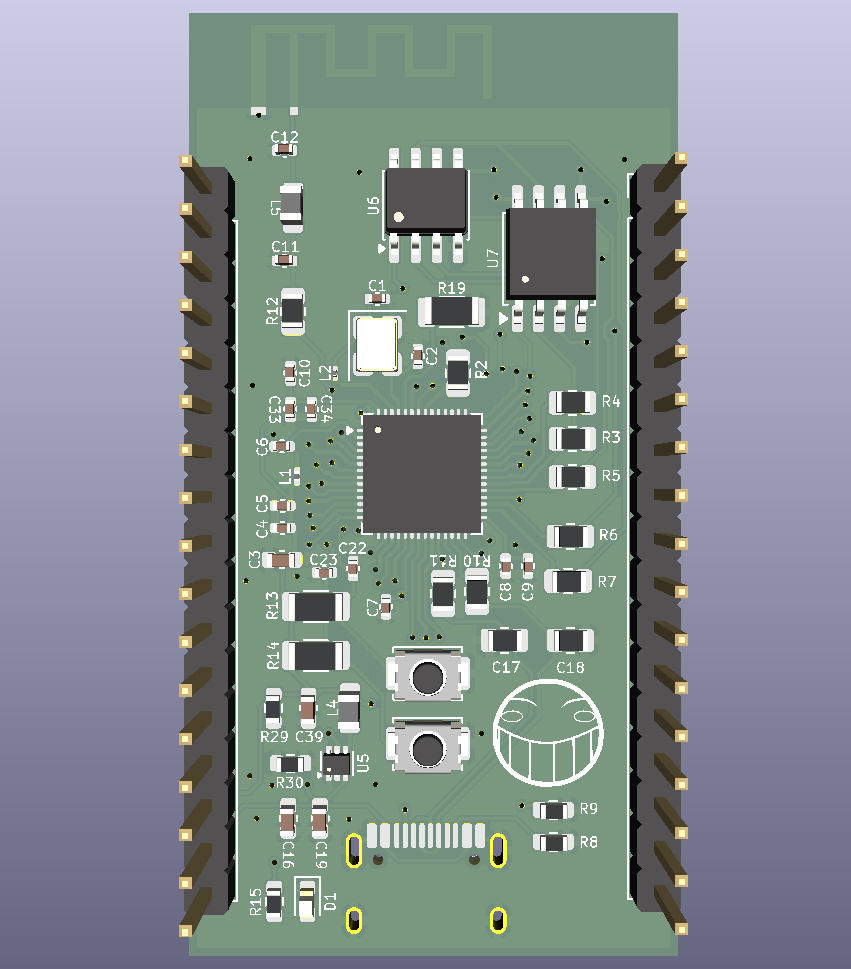
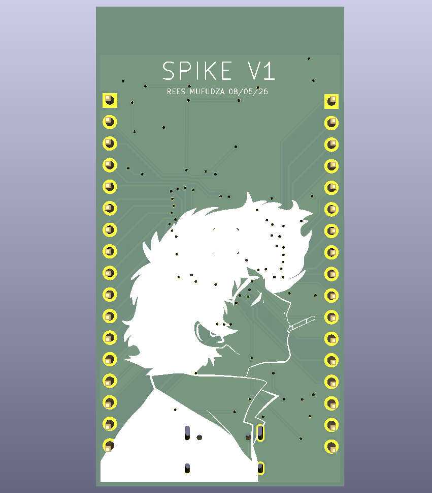
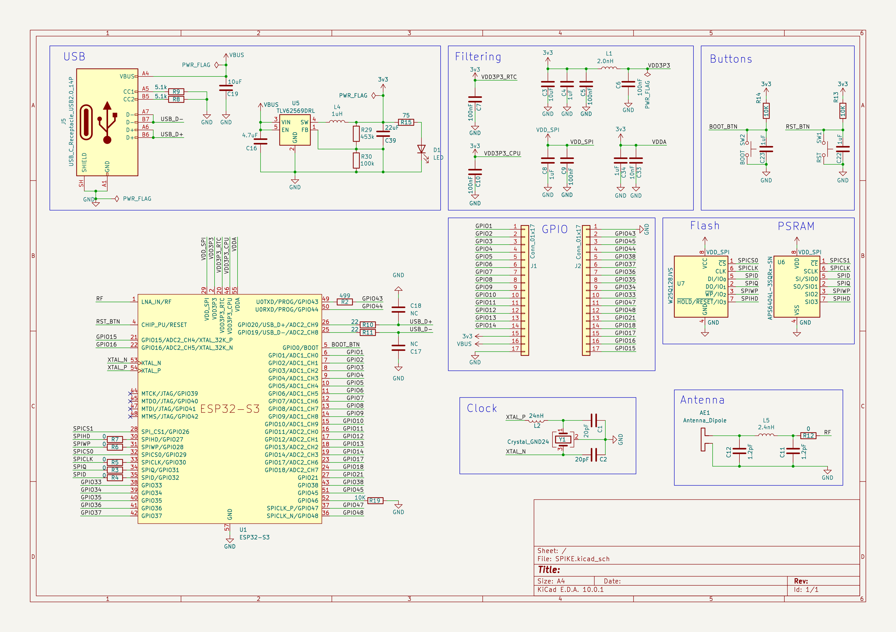
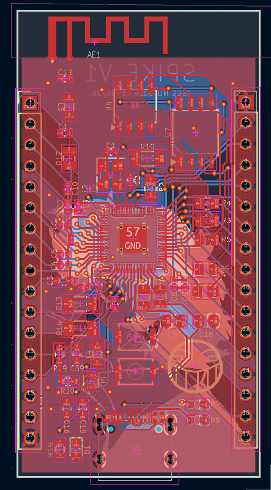
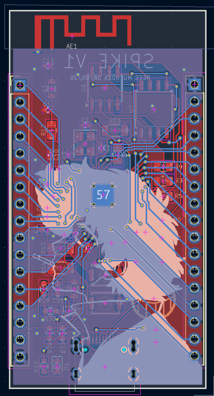

# SPIKE
A sleek and speedy ESP32-S3 powered development board

Designed in KiCAD as part of STASIS for Hack Club. I took up this project to learn more about PCB and MCU design. This acts as a prototype of sorts to my e-Reader project <a href="https://github.com/cr1spyapple/Bebop">"Bebop"</a> which will use similar hardware to this.

 

## Specs:
- 32 GPIO pins
- 16MB flash
- 8MB PSRAM
- WiFi and Bluetooth connectivity
- USB-C port

## Schematic

## PCB Traces

